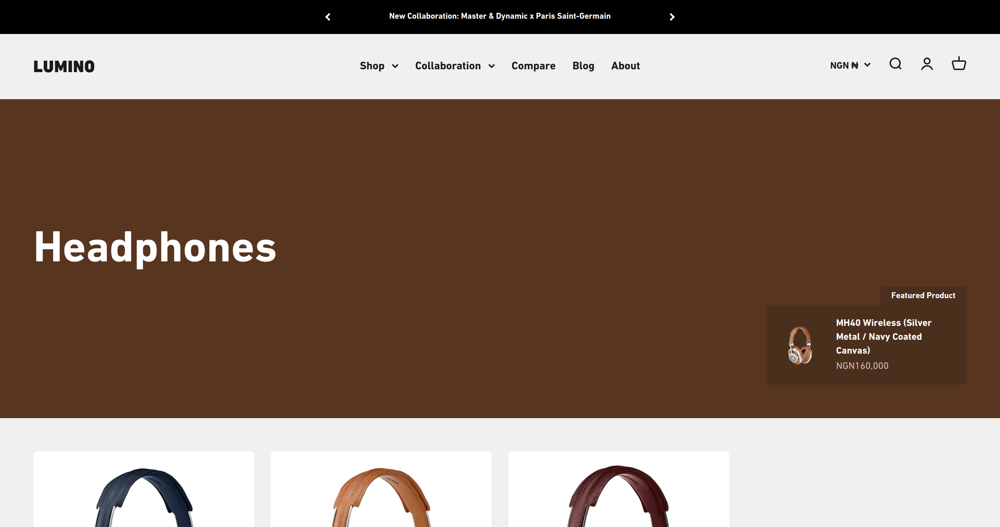
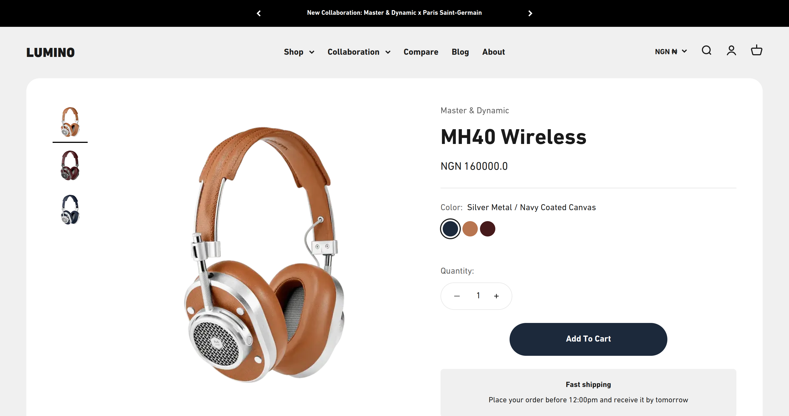

# Lumino

[](https://opensource.org/licenses/MIT)

A modern eCommerce website built using Next.js, Sanity, and Shopify, providing a seamless shopping experience.

## Table of Contents

- [Demo](#demo)
- [Built With](#built-with)
- [Features](#features)
- [Screenshots](#screenshots)
- [Installation](#installation)
- [Usage](#usage)
- [Contributing](#contributing)
- [License](#license)

## Demo

Check out the live demo of the website [here](https://luminostore.vercel.app).

Since the shopify store is in development mode, you will need the store password to access the checkout page.
The store password is `luminostpassword`

## Built With

- Typescript
- React
- Next.js
- Sanity CMS
- Shopity
- TailwindCSS

## Features

- Responsive design for various devices.
- Product browsing and searching.
- Product details with descriptions, images, and pricing.
- Shopping cart functionality.
- Checkout process powered by Shopify.
- Secure payment options.

## Screenshots





## Installation

1. Clone the repository.
   ```bash
   git clone https://github.com/peter-abah/lumino
   ```
2. Navigate to the project directory.
   ```bash
   cd lumino
   ```
3. Install dependencies.
   ```bash
   npm install
   ```
4. Setup a shopify store and add neccesary env variables. See [this guide](https://vercel.com/guides/building-ecommerce-sites-with-next-js-and-shopify) on setting up Shopify with Nextjs.
5. Create a sanity project and add the project id and dataset id to your env file
6. Add site content to sanity using sanity studio

## Usage

To run the website locally:

```bash
npm run dev
```

Visit `http://localhost:3000` in your browser to view the website.

## Contributing

Contributions are welcome! If you'd like to contribute to this project, please follow these guidelines:

1. Fork the repository.
2. Create a new branch.
   ```bash
   git checkout -b feature/my-feature
   ```
3. Make your changes and commit them.
   ```bash
   git commit -am 'Add some feature'
   ```
4. Push to the branch.
   ```bash
   git push origin feature/my-feature
   ```
5. Create a new pull request.

## License

This project is licensed under the [MIT License](LICENSE).

## Acknowledgements

This site uses the design and assets gotten from [Impact Theme Sound](https://impact-theme-sound.myshopify.com/) which belongs to [Maestroo](https://maestrooo.com/).

## Authors

👤 **Peter Abah**

- GitHub: [@peter-abah](https://github.com/peter-abah)
- Twitter: [@oddabok](https://twitter.com/oddabok)
- LinkedIn: [LinkedIn](https://linkedin.com/in/abah-peter)
